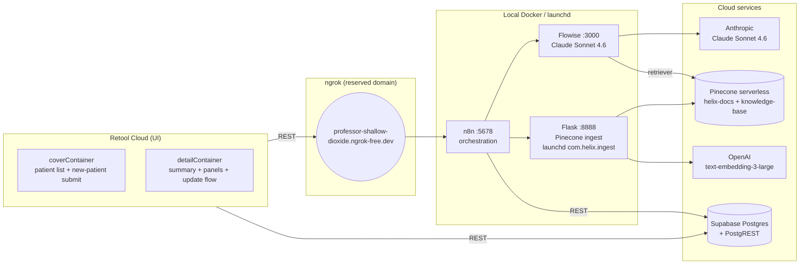
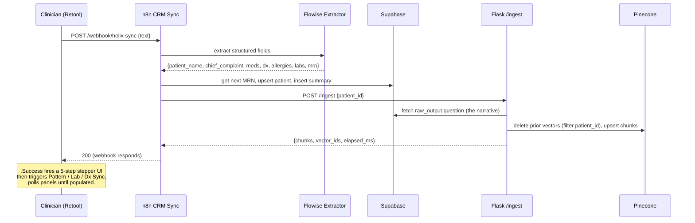
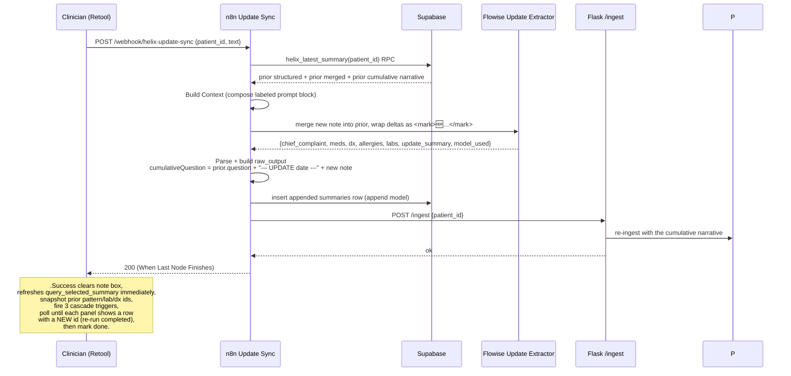

# Helix CRM

> An AI-assisted clinical CRM that turns free-text notes into a living patient record — with proactive pattern, lab, and differential-diagnosis analysis on every visit, and a merged living document that highlights what changed between encounters.

---

## Executive summary

Outpatient clinicians spend roughly a third of their time on notes — and the notes they write are mostly write-only. By the next visit the prior reasoning is buried in PDFs and EHR scrolls; trends across visits go unseen; the same clarifying questions get asked again because no one remembered to. Helix CRM is a thin, AI-assisted layer over a clinician's free-text notes that reverses that loss:

- **Submit a note once.** Helix extracts structured fields, generates a recommendation panel for labs to order, a differential-diagnosis panel of exclusions to consider, and a longitudinal pattern analysis — all evidence-cited against guideline sources.
- **Return for a follow-up.** Helix doesn't replace the prior chart; it **merges the new note into a living document**, highlights what changed, and re-runs the analyses cumulatively across all visits.
- **Read at a glance.** The detail view is one merged markdown document with `<mark>` highlights on the most recent additions, surrounded by the supporting panels.

What is novel here is not any single AI feature but the loop: **append-only history → cumulative retrieval → merged living document → re-run analyses on the cumulative state.** Phase 3.6 (this session's build) closed that loop end-to-end.

This document covers the architecture, two end-to-end walkthroughs, the tech stack, the phase history, and the Phase 4 roadmap (including known debt — surfaced rather than hidden).

---

## Architecture at a glance



**Component roles, one line each:**

| Component | Role |
|---|---|
| **Retool** | Single-page UI: patient list, new-patient submit, detail view with 5 panels, in-session update flow. Cloud-hosted. |
| **n8n** | Webhook-driven orchestration. Each clinical action is a workflow (Helix CRM Sync, Pattern/Lab/Dx Sync, Update Sync, etc.). Local Docker, exposed via ngrok. |
| **Flowise** | LLM chatflows: Helix Extractor, Pattern Recognition, Lab Recommendations, Dx Exclusion, Sample Note Generator, Helix Update Extractor, Helix Update Note Generator. All on Claude Sonnet 4.6 via the `helix-anthropic` credential. |
| **Supabase Postgres** | System of record. 6 tables (`patients`, `summaries`, `patterns`, `lab_recs`, `dx_exclusions`, `questions`), 1 view (`helix_patient_latest`), 3 RPC functions (`helix_latest_summary`, `helix_purge_test_debris`, `helix_restore_canonical_state`). RLS on, service-role-only for demo posture. |
| **Pinecone serverless** | Two indexes: `helix-docs` (per-patient narrative chunks, filtered by `patient_id` metadata) and `knowledge-base` (clinical guideline reference for evidence-cited recommendations). |
| **Flask `serve_ingest.py`** | Tiny purpose-built server (~120 LOC) running under launchd at `~/helix-ingest/`. Exposes `POST /ingest` with `X-Helix-Token` auth; reads the latest summary row from Supabase, chunks the narrative, embeds via OpenAI, upserts to Pinecone. |
| **OpenAI** | Embeddings only: `text-embedding-3-large` at Matryoshka-reduced 1024 dimensions to match the index. |
| **ngrok** | Reserved-domain tunnel exposing the local n8n to Retool Cloud over a stable HTTPS URL. |

---

## Walkthrough 1 — Submitting a new patient

The clinician lands on the patient list (coverContainer). They click **Generate sample note** (or paste their own clinical note) into the intake textarea, then **Submit**. Behind the scenes:



The 5-step stepper (`progressStepper`, driven by the `submitProgress` Variable) shows: saving the note → analyzing patterns → generating lab recommendations → identifying diagnoses to rule out → "All analyses complete — opening chart." Retool then navigates to the detail view, where the merged summary and all four panels are already populated, evidence-cited against guidelines (USPSTF, NICE, AAFP, etc.).

Total latency from Submit to fully populated detail view: roughly 60–90 seconds, dominated by the parallel cascade workflows.

---

## Walkthrough 2 — In-session update (Phase 3.6)

This is the loop that makes Helix more than a one-shot extractor. The clinician is in the detail view for an established patient who's returned for a follow-up. They click **Generate Update Note** (or paste their own follow-up note). After it lands in the box, they click **Submit Update**.



Three things in that flow are worth noting because they are the technical core of Phase 3.6:

1. **Append, not overwrite.** Every update writes a new `summaries` row. History is preserved for diff and retrieval. The patient list/detail panels read latest-per-patient via the `helix_patient_latest` view (`SELECT DISTINCT ON (patient_id) … ORDER BY patient_id, created_at DESC`), so users see current state; full versions stay in `summaries`.
2. **Cumulative retrieval.** n8n deterministically concatenates the prior cumulative narrative + a separator + the new note before re-ingesting. Pinecone chunks now span all visits. Pattern Recognition (which retrieves from `helix-docs` with a `patient_id` filter) automatically surfaces cross-visit trends without any retrieval-side change.
3. **Merged living document with diff highlights.** The Update Extractor produces an `update_summary` field — full markdown with `## Chief Complaint`, `## History of Present Illness`, … `## Assessment & Plan` — where every span that's new or changed in this update is wrapped as `<mark>🆕 …</mark>`. The Summary panel renders it with a yellow highlight on the changes; never-updated patients see the original structured fields composed in the same section layout (fallback in the Markdown binding).

End-to-end latency: ~30 seconds for the synchronous `Helix Update Sync` chain (Flowise merge + insert + Pinecone re-ingest), then ~60 seconds for the cascade re-runs in the background.

---

## Tech stack & key design decisions

### Models

- **Claude Sonnet 4.6** (Anthropic) for all generative work: extraction, merge, pattern reasoning, lab recommendations, dx exclusion reasoning, sample note generation. Temperature 0.2 for structured-output flows, 0.8 for the synthetic-note generator.
- **OpenAI text-embedding-3-large @ 1024 dim** for retrieval embeddings. Matryoshka-reduced dimension chosen to match the Pinecone index spec.

### Retrieval architectures (two patterns)

- **Per-patient retriever** (Phase 1–2 flows): Flowise chatflow has a Pinecone retriever on `helix-docs` with a `patient_id` metadata filter. The model reads the patient's full cumulative narrative as context. Requires per-patient ingestion (Flask `/ingest`).
- **n8n-injected context** (Phase 3 flows for Lab Recs and Dx): n8n fetches the latest summary from Supabase and injects it as text in the Flowise prompt. Only the `knowledge-base` retriever is wired into the chatflow. Faster, no per-patient ingest dependency for those flows.

### Why both?

Patterns are inherently temporal — they need the full visit history. Lab recs and dx exclusions reason from the *current* state. Different retrieval shapes serve different reasoning shapes.

### Append model vs. read model

The DB writes append-only (history-preserving, diff-ready, cumulative-retrieval-friendly). The UI reads latest-per-patient via the `helix_patient_latest` view (one row per patient). A user-facing version-history drawer is Phase 4 — the data is already there.

### Operational footprint

Everything except Retool runs locally on the developer's Mac: n8n and Flowise as Docker containers, Flask as a launchd-managed service. ngrok exposes the n8n webhook surface to Retool Cloud over a reserved domain so the URL stays stable across restarts. Supabase and Pinecone are managed cloud services. OpenAI and Anthropic are direct API consumers.

---

## Phase history

| Phase | Delivered |
|---|---|
| **1 — Document summarization + CRM** | Helix Extractor chatflow, CRM Sync n8n workflow, `patients` + `summaries` tables. Submit a note → structured row. |
| **2.1 — Pattern recognition** | Pattern chatflow (per-patient retriever), `patterns` table, Pattern Sync workflow. Cross-visit symptom/lab/contradiction analysis. |
| **2.2 — Question generation** | Question chatflow (Pattern → Question chain), `questions` table, Question Sync workflow. Open-ended clinical questions per pattern. |
| **3.2 — Lab recommendations** | Lab Recs chatflow (Tool Agent + knowledge-base retriever), `lab_recs` table, evidence-cited recommendations with uncertainty disclaimers. Two-patient regression harness. |
| **3.3 — Differential exclusions** | Dx Exclusion chatflow (cloned from Lab Recs, strict scope), `dx_exclusions` table, ranked exclusions with USPSTF/NICE citations. |
| **3.4 — Fixture backfill** | Backfill scripts for SYNTH-002…010 via the live CRM Sync webhook; canonical dataset standardised. |
| **3.5 — Per-patient Pinecone + sample notes + auto-cascade** | `ingest_patient_pinecone.py` + Flask `/ingest` (launchd), Sample Note Generator chatflow + n8n wrapper, full Submit → cascade → stepper → detail flow. |
| **3.6 — In-session patient updates (this session)** | Update Extractor chatflow + Update Sync workflow + Update Note Generator + Retool update UI. Append model, cumulative `raw_output.question`, merged living document with `<mark>` highlights, snapshot-and-wait cascade detection, dedicated `updateProgress` Variable, `helix_patient_latest` read view, `helix_latest_summary` RPC. |

---

## Phase 4 roadmap — what's deferred, and why

These are the items consciously deferred. They are surfaced rather than hidden because honest scoping builds more trust than a too-clean pitch.

### Security & compliance (gate to production)

- **Rotate the API keys** exposed in development sessions (OpenAI, Pinecone, the Flask ingest token). Routine post-demo hygiene.
- **SSO + audit logging.** Retool supports SAML/OIDC; n8n and Flowise need auth headers in front of their tunnels.
- **BAA-covered Pinecone tier** for any real PHI; the current serverless tier is fine for synthetic fixtures only.

### Reliability & polish

- **`activePatientId` Variable refactor.** Today every panel query binds to `table1.selectedRow?.patient_id ?? table1.data[0]?.patient_id`. During the new-patient submit's Phase 1 polling, each `query_summaries.trigger()` cancels in-flight panel queries (logged as "duplicate run" warnings). A dedicated `activePatientId` Variable that only updates on explicit row selection eliminates the cascade. Pure refactor, low risk, ~1 hour.
- **Cross-panel highlights.** `<mark>🆕 …</mark>` currently appears only in the merged summary. Extending it to the Patterns / Lab Recs / Dx panels would require each chatflow to accept its prior run's output as context and wrap deltas. ~3–5 hours per chatflow with prompt iteration; Dx is the wildcard given its strict-scope prompt history.
- **Version-history drawer.** The append model retains every prior summary version in `summaries`. A drawer in the detail view that lets a clinician scrub through prior versions / diff against the current is a natural Phase 4 reveal that ships zero new backend.
- **Docker-ize Flask.** Currently a launchd service running from `~/helix-ingest/`. Moving it into a Compose stack with n8n and Flowise unifies operations.

### Form factor

- **Mobile-responsive layout.** Same Retool app, layout-only adaptations. Deferred while the desktop demo is the active artifact.

### Workflow extensions (genuine new features)

- **Clinician sign-off + audit trail.** The DB already has `clinician_signoff / signoff_at / signoff_by` columns on every panel table — just unwired in the UI. Wiring "Mark reviewed" buttons to actually persist these closes the audit loop.
- **Multi-clinician collaboration.** Right now there's one logical user. A real deployment shards patient lists by clinician and adds presence/handoff.

---

## Repository layout

```
helix-crm/
  PRODUCT.md            ← this file
  README.md             ← quickstart, setup, env, run order
  .env.example
  scripts/
    ingest_patient_pinecone.py      Per-patient Pinecone ingest (CLI + library)
    serve_ingest.py                 Flask /ingest server (launchd-managed)
    backfill_summaries.py           Fixture backfill via CRM Sync
    backfill_patterns_questions.py
    backfill_labs_dx.py
    purge_pinecone_by_ids.py        Cleanup companion to helix_purge_test_debris
    test_lab_recs.py                Two-patient lab-recs regression harness
    test_dx_exclusions.py           Two-patient dx-exclusions regression harness
  knowledge-base/                   Clinical-guideline source PDFs (ingested to Pinecone knowledge-base index)
  test-data/                        Synthetic patient PDFs (12 canonical SYNTH-*)
  helix-tasks.md                    Build log (phases 1 through 3.6)
  flowise/chatflows/                Exported Flowise chatflow JSON (Phase 4: add to repo)
  n8n/workflows/                    Exported n8n workflow JSON (Phase 4: add to repo)
  retool/                           Retool app export (Phase 4: add to repo)
  supabase/migrations/              SQL for views/functions (Phase 4: extract to repo)
```

### Key Supabase objects (for reproducibility)

- **View** `public.helix_patient_latest` — one row per patient, latest version (read model for the patient list and the summary panel).
- **RPC** `public.helix_latest_summary(p_patient_id text) returns jsonb` — called by n8n Update Sync to compose the merge prompt without using a Code-node fetch (the user's n8n 2.17.8 Code sandbox blocks `fetch`, `require`, and `this.helpers.httpRequest`).
- **RPC** `public.helix_purge_test_debris(p_cutoff timestamptz)` — date-cutoff demo cleanup; CASCADE removes child rows; returns deleted `patient_id`s for Pinecone follow-up.
- **RPC** `public.helix_restore_canonical_state(p_patient_id text)` — per-patient rollback to the oldest of each child table; pair with `ingest_patient_pinecone.py` to restore Pinecone.

---

## Status

- **Phase 3.6 complete and verified end-to-end** on synthetic fixtures (SYNTH-001…011 + 013).
- 12 canonical patients; append model history preserved in DB; Pinecone at 59 vectors covering current cumulative state.
- Retool app published in Latest; private repo to follow.

*Last updated: end of Phase 3.6 build, 2026-05-20.*
